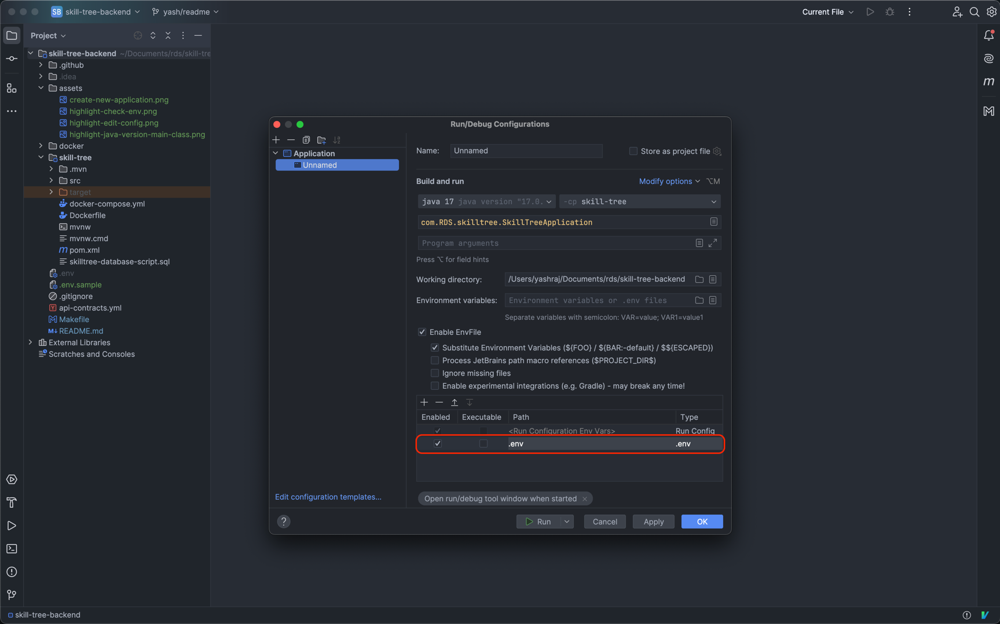

# Skill Tree Backend

## Required Tools
- [Homebrew](https://brew.sh/) (If you're using macOS)
- [Maven](https://maven.apache.org/download.cgi) (version 3.9.6 or higher)
- [Java](https://www.oracle.com/in/java/technologies/downloads/#java17) (version 17)
- [IntelliJ Community or Ultimate Edition](https://www.jetbrains.com/idea/download/other.html)
- [Docker Desktop](https://www.docker.com/products/docker-desktop/)

## Development Setup
### Install Maven
#### macOS
1. To install maven type the following command in your terminal:
   ```bash
   brew install maven
   ```
2. Verify your installation using the following command:
   ```bash
   mvn -version
   ```
   If maven is installed correctly you should see the maven version in the terminal:
   ```bash
   Apache Maven 3.9.7
   ```

#### Windows
1. To install Maven on Windows, we head over to the Apache Maven site to download the latest version and select the Maven zip file, for example, apache-maven-3.9.6-bin.zip.
2. Adding Maven to the Environment Path
   We add both M2_HOME and MAVEN_HOME variables to the Windows environment using system properties and point them to our Maven folder.
3. Verify the Maven installation by typing:
   mvn -version
4. Then, we update the PATH variable by appending the Maven bin folder — %M2_HOME%\bin — so that we can run the Maven command everywhere.

### Setup database and configure env
- To setup the database & create a `.env` file run the following command in your terminal:
   ```bash
  make setup 
  ```
  - To edit your environment variables edit the `.env` file.

#### NOTE: 
- If you do not have `make` installed, run the `docker-run` and  `copy-env` commands from the `Makefile` manually. 

### Install EnvFile Plugin in IntelliJ
- To read the values from your `.env` you will need install the `EnvFile` plugin.
- To Install the plugin to go `settings` > `Plugins` > `Marketplace` > EnvFile.
   

### Create a configuration in IntelliJ
- Press the Edit configurations button on the top right of your screen
    
- Create a new application
    
- Select `Java version 17`, `Skill tree` and `SkillTreeApplication`
    
- Check `EnvFile` and `Substitute Environment Variables`
    
- Add path to the `.env` file you created above
    
    - You should a new entry like so:
        
    - Click on `Apply` and then `Ok`

### Running your application
- Press the `Run` button on the top right of your screen to run the application.
    

## Steps to run authenticate a user locally
- Run RDS backend on your local machine
- Copy the `public key` from `local.js` (if not in `local.js` copy it from `development.js`) and add it in your `.env` file.
- Run skill tree frontend, click on `signin with github` button
    - Once authenticated you will be redirected to `localhost:4000` (skill tree frontend dashboard) and a `rds-session-v2-development` cookie will be set in the browser which you can when making API calls locally.
    - NOTE:
        - make sure that `incomeUserDetails` for your user is set to false else the redirect will not work correctly


## To Authenticate Yourself

Using [Website - backend](https://github.com/Real-Dev-Squad/website-backend)
On Local - http://localhost:3000/auth/github/login?redirectURL=https://staging-skilltree.realdevsquad.com/tasks?v2=true
This will create a cookie in your browser `rds-session-v2-development`

On Staging - https://staging-api.realdevsquad.com/auth/github/login?redirectURL=https://staging-skilltree.realdevsquad.com/tasks?v2=true
This will create a cookie in your browser named `rds-session-v2-staging`

## Contributing

### Code Formatting

This repo uses https://github.com/diffplug/spotless/tree/main/plugin-maven#java for formatting files.

Please build using `mvn compile` in local or run `mvn spotless:apply` before pushing the code to fix any formatting errors.
To check if the codebase is formatted, you can explicitly use `mvn spotless:check`

The Continuous Integration build for pushed commits may fail when a Pull Request is created if your code doesn't follow project's formatting guideline.
